[قسمت بعدی: قسمت چهارم - اضافه کردن فایل ها به محیط staging](./4-staging.md)

# آموزش استفاده از گیت از طریق محیط کامندلاین
در این قسمت ما یاد میگیریم چطور با استفاده از دستورات محیط کامند لاین و محیط گرافیکی از گیت استفاده کنیم.

## استفاده از محیط کامندلاین

محیط کامند لاین محیطی هست که در اون میتونیم با تایپ کردن دستورات متنی به کامپیوتر فرمان بدیم. این محیط غیرگرافیکیه و با نرم افزارهای متعارفی که محیط رنگارنگ و کاربرپسند تر دارند تفاوت داره.
ویندوز به طور پیشفرض دو محیط کامند لاین به نام های CMD و Windows Power Shell داره. اما نرم افزار ویندوز گیت همراه با خودش یک محیط کامندلاین دیگه هم نصب میکنه که Git Bash نام داره. برای دسترسی به گیت بش ما دو راه داریم:

### از طریق منوی استارت

در منوی استارت اسم Git Bash را جستجو و نرم افزار  Git Bash را باز کنید.

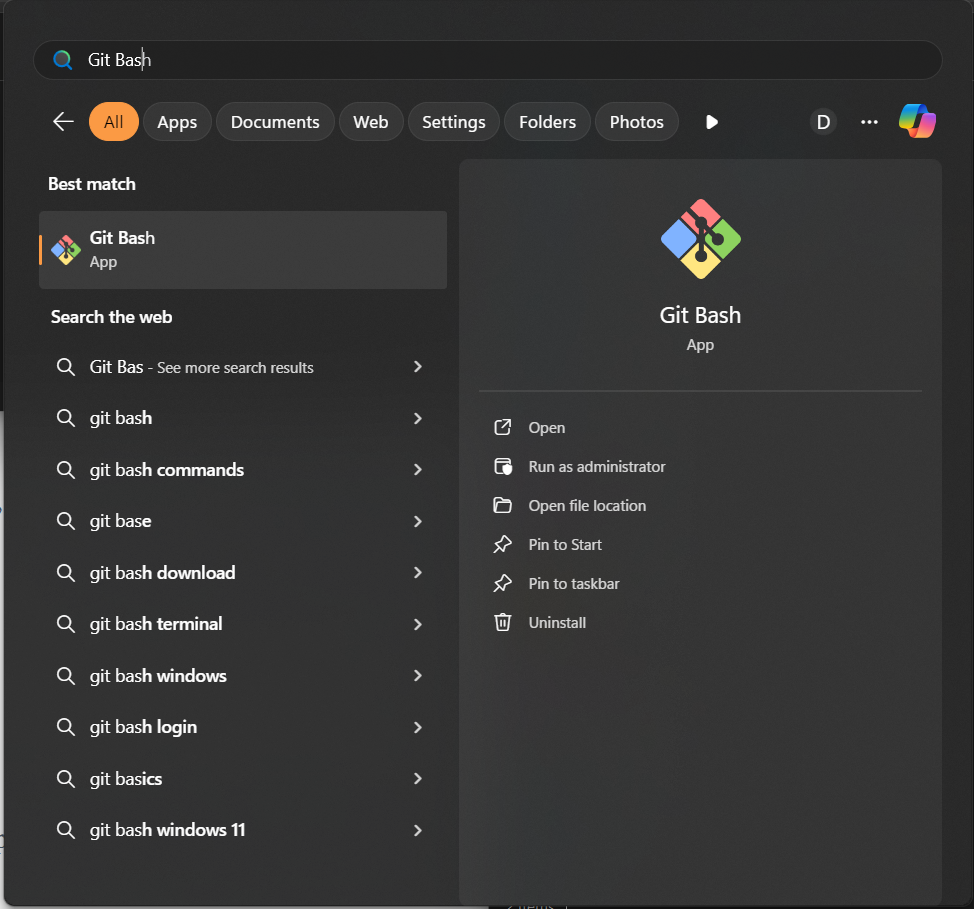

### از طریق منوی راست کلیک
در پوشه ای که قصد داریم در اون دستورات گیت بش رو اجرا کنیم راست کلیک میکنیم. سپس بر روی Open Git Bash Here کلیک میکنیم.

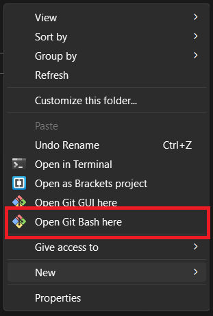

محیط گیت بش چنین شکلی داره:

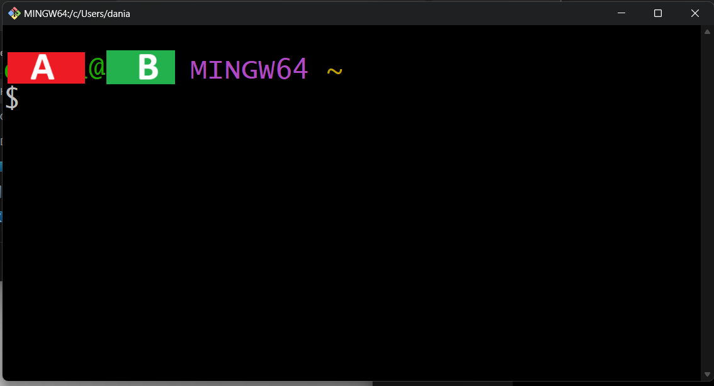
قسمتی که مربع دورش خط کشیده شده ساختار یک prompt بش هست. قسمت A اسم کاربر، قسمت B اسم کامپیوتر ما  و قسمت C مکانی هست که در حال حاضر گیت بش در اون قرار داره (که علامت تیلدا یا ~  در حال حاضر به این معناست که بش در پوشه ریشه یا روت root هست. این پوشه همون پوشه پیش فرضیه که با باز کردن بش در ابتدا وارد اون میشیم). بعد از @ میتونیم دستور بش خودمون رو وارد کنیم.
در ابتدا میخوایم چند تا از دستورات محیط گیت بش رو با هم دیگه یاد بگیریم. اولین دستور pwd هست. این دستور به ما میگه که ما در کجا قرار داریم.

	pwd
خروجی:

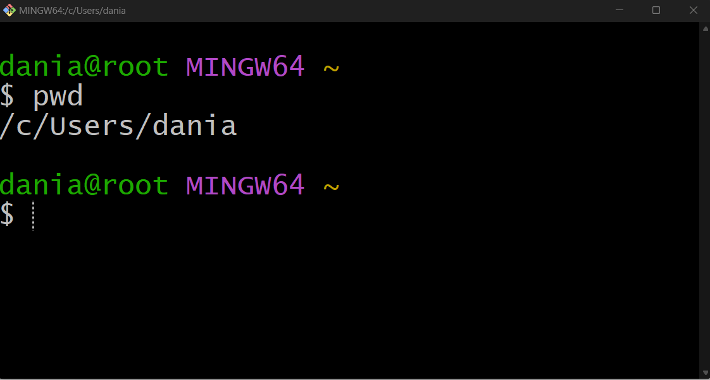

با استفاده از دستور ls میتونیم فایل هایی که در پوشه کنونی قرار داره رو مشاهده کنیم.

	ls
خروجی:

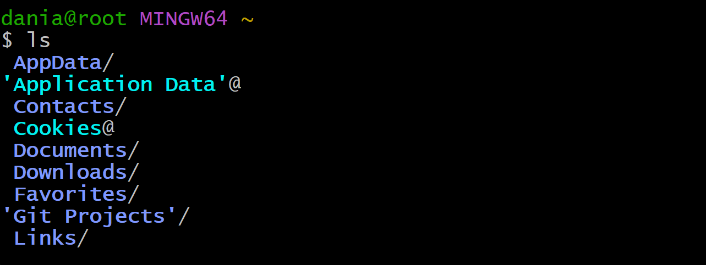

با دستور cd میتونیم مسیری که هم اکنون گیت بش ما در اون قرار داره رو تغییر بدیم. یک نقطه (.) پوشه ای که هم اکنون در اون قرار داریم رو نشون میده. برای مثال اگه در حال حاضر در پوشه ~ هستیم و میخوایم به پوشه games که در پوشه root قرار داره بریم، این دستور رو وارد میکنیم:

	cd ./games
یا این که میتونیم آدرس کامل فایل رو بین دو تا '' یا single quote وارد کنیم.

	cd '/c/Users/dania/games'
   
خروجی:

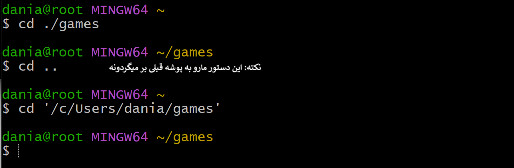

حالا فرض کنیم که پوشه قبلی ما (یعنی Documents) که پوشه Games ما در اون قرار داره یه پوشه دیگه هم به اسم School داره که میخوایم وارد اون بشیم. برای دسترسی به پوشه قبل تر از دو نقطه (..) استفاده میکنیم. به پوشه قبل تر از پوشه ای که در حال حاضر هستیم پوشه parent هم میگن.

	cd ../
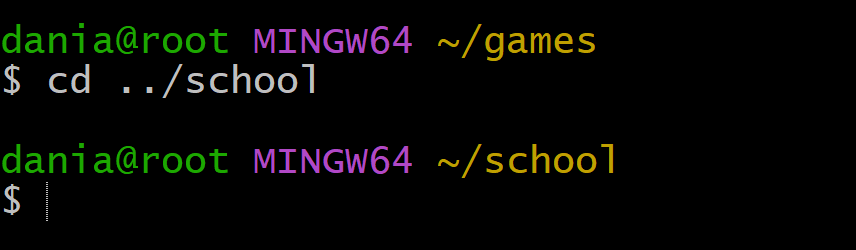

نوبت استفاده از گیته. برای اینکه ببینید از چه نسخه‌ی گیت استفاده میکنید این دستور رو وارد کنید:

	git --version
خروجی:

	git version 2.47.1.windows.1

برای اینکه گیت اجازه فعالیت بدیم باید گیت رو در پوشه‌ی پروژه‌مون به اصطلاح initialize یا init کنیم. init کردن، پوشه ما رو به یه ریپازیتوری گیت تبدیل میکنه. ریپازیتوری مخزنیه که تمامی فایل‌ها نسخه‌های مختلف پروژه در اونجا ذخیره میشه. برای تبدیل کردن پوشه به ریپازیتوری اول وارد پوشه مورد نظر میشیم و بعد این دستور رو وارد میکنیم:

	git init
حالا پوشه ما تبدیل به یک ریپازیتوری شده و میتونیم از قابلیت های ذخیره تغییرات پروژه و مشارکت گروهی استفاده کنیم.
ایجاد پروژه با استفاده از نسخه گرافیکی
استفاده از محیط گرافیکی به مراتب کم دردسر تره و از دستورات ناآشنای بش اونجا خبری نیست.

## محیط گرافیکی
برای init کردن گیت با استفاده از محیط گرافیکی، در ابتدا وارد پوشه مورد نظر شده و راست کلیک میکنیم. و یا اینکه از طریق منوی استارت به دنبال برنامه Git GUI میگردیم.

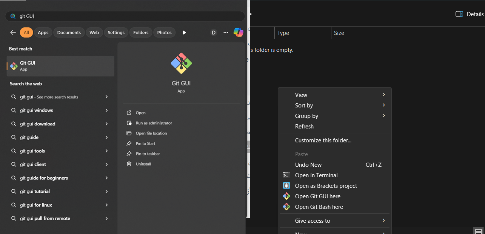

محیط گرافیکی گیت چنین شکلی داره.

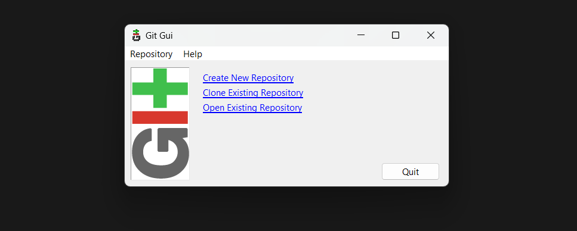

برای init کردن و ساختن ریپازیتوری گیت بر روی گزینه Create New Repository کلیک کنید. سپس پوشه ای که میخواهید ریپازیتوری شما آنجا باشد را انتخاب کرده و سپس بر روی گزینه Create کلیک کنید.

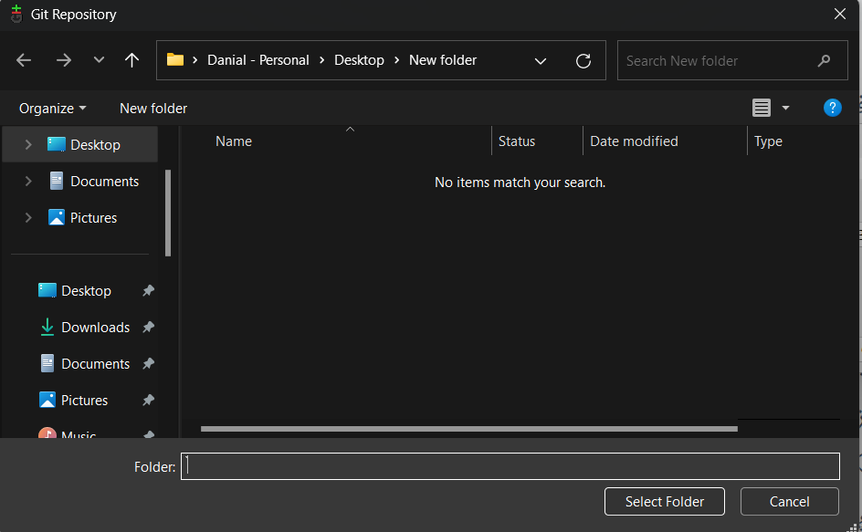

بدین ترتیب ریپازیتوری گیت شما آماده است!
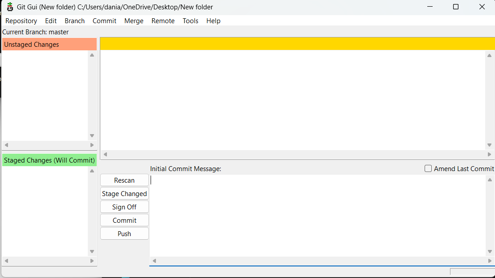

[قسمت بعدی: قسمت چهارم - اضافه کردن فایل ها به محیط staging](./4-staging.md)
